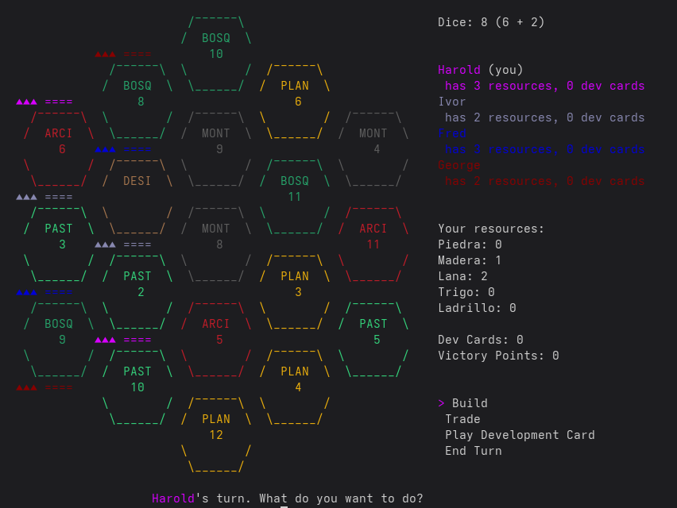

# El Poblador - Settlers of Catan TUI

A terminal-based implementation of Settlers of Catan in Go.



## Installation

Refer to the latest instructions [on sourcehut](https://sr.ht/~vicho/el_poblador/), as that's where **development has moved**.

## Running the Project

```bash
go run main.go new <player1> <player2> <player3> [player4]
```

Runs the main Catan game with 3-4 players. Provide player names as command-line arguments.

```bash
go run main.go load <savefile>
```

Loads a saved game.

**Controls:**
- Arrow keys: Move cursor
- Enter: Confirm action
- Esc: Cancel action (not always available)
- 1-4: Switch to specific player's perspective
- 0: Switch back to current turn holder's perspective
- q/Ctrl+C: Quit game  (to be removed)

## License

EUPL v1.2, in spanish
